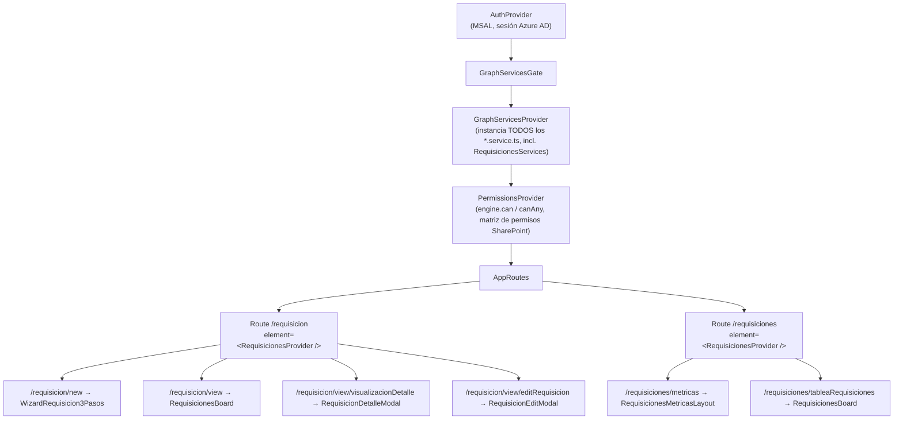

# Módulo de Requisiciones

Documentación funcional y técnica del módulo de Requisiciones (gestión de vacantes) de CH-Docusign.

## Qué hace este módulo

Cubre el ciclo de vida completo de una vacante ("requisición"):

1. **Creación** — un wizard de 2 pasos calcula automáticamente el ANS (fecha límite según días hábiles), asigna un responsable (analista) y notifica por correo.
2. **Seguimiento** — un tablero (tabla) con filtros, orden y paginación server-side contra SharePoint (vía Graph).
3. **Detalle / edición** — modales para ver el detalle completo, editar campos, reportar problemas y postergar el ANS.
4. **Checklist del proceso** — una plantilla de pasos configurable (SharePoint) que se instancia por cada requisición y se va marcando "Completado"/"Omitido".
5. **Métricas** — un dashboard con KPIs, embudo de selección, tendencias mensuales y agrupaciones por dirección/ciudad/analista.

## Por dónde empezar

- **¿Por qué `useRequisiciones` viene de un Context? ¿Cómo se inyecta?** → [01-contexto-e-inyeccion.md](./01-contexto-e-inyeccion.md) — esto responde directamente la pregunta que originó esta documentación.
- Flujo de creación (wizard, ANS, responsable, notificaciones) → [02-creacion-de-requisicion.md](./02-creacion-de-requisicion.md)
- Tablero, filtros, detalle y edición → [03-listado-tablero-y-detalle.md](./03-listado-tablero-y-detalle.md)
- Checklist del proceso (pasos por requisición) → [04-checklist-del-proceso.md](./04-checklist-del-proceso.md)
- Dashboard de métricas → [05-metricas-dashboard.md](./05-metricas-dashboard.md)
- Modelo de datos, servicios SharePoint y permisos → [06-modelo-datos-servicios-permisos.md](./06-modelo-datos-servicios-permisos.md)

## Mapa de carpetas

```
src/
├── Funcionalidades/Requisiciones/
│   ├── RequisicionesContext.tsx          # Context + Provider (el "pegamento" de todo el módulo)
│   ├── Requisicion/
│   │   ├── Hooks/
│   │   │   ├── requisicion.ts            # useRequisicion() — hook raíz, compone los de abajo
│   │   │   ├── useRequisicionForm.ts     # estado del formulario / borrador (state, setField)
│   │   │   ├── useRequisicionFilters.ts  # filtros de búsqueda + seguridad por permisos
│   │   │   ├── useRequisicionPagination.ts
│   │   │   ├── useRequisicionList.ts     # fetch de filas (paginado por nextLink de Graph)
│   │   │   ├── useRequisicionActions.ts  # crear, editar, cancelar, postergar ANS
│   │   │   └── useRequisicionNotifications.ts # plantillas de correo
│   │   └── utils/                        # cálculo de ANS, responsable, payload, validación...
│   ├── DetallesRequisicion/               # hooks del checklist (plantilla + detalle por requisición)
│   └── ANS-Requisicion/
├── Components/Requisiciones/
│   ├── NuevaRequisicion/                 # wizard de creación
│   ├── tablaRequisiciones/               # tablero + modales de detalle/edición + checklist visual
│   └── Metricas/                         # dashboard (layout, tabs, charts, contexto propio)
├── Services/Requisiciones/               # clientes SharePoint (uno por lista)
├── models/Requisiciones/                 # tipos: requisiciones, pasos, plantaIdeal...
├── graph/graphContext.tsx & graphDomains.ts # registro de TODOS los servicios de Graph (no solo Requisiciones)
└── Routes/
    ├── index.tsx                         # aquí se monta <RequisicionesProvider /> en las rutas
    └── Wrapper/                          # componentes "pegamento" entre rutas y componentes de UI
```

## Árbol de providers (de arriba hacia abajo)



Nota importante: `/requisicion` y `/requisiciones` son **dos árboles de rutas distintos**, cada uno con **su propia instancia** de `<RequisicionesProvider />`. Ver [01-contexto-e-inyeccion.md](./01-contexto-e-inyeccion.md#gotcha-dos-instancias-del-provider) para el detalle de por qué esto importa.
